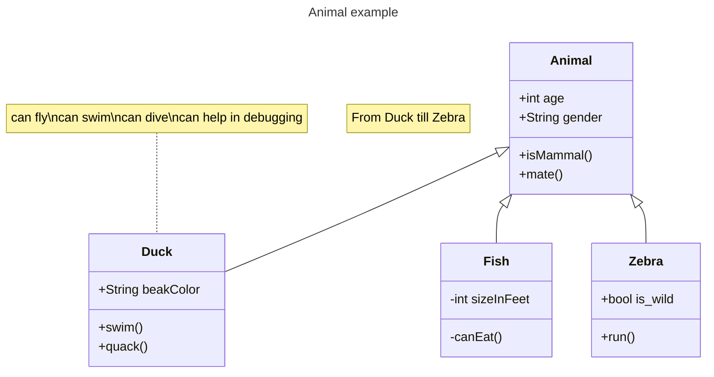
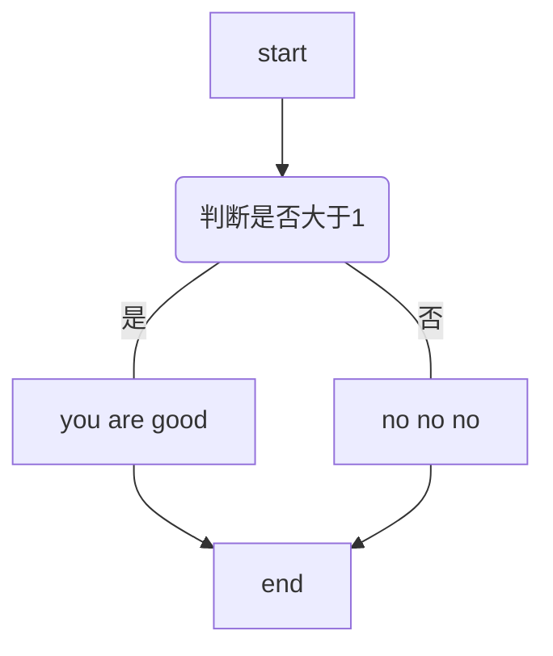

# 实验七 Python面向对象编程

班级： 21计科04

学号：B20210302413

姓名： 石俊男

Github地址：<https://github.com/D4rshan0305/python_storehouse>

CodeWars地址：<https://www.codewars.com/users/D4rshan0305>

---

## 实验目的

1. 学习Python类和继承的基础知识
2. 学习namedtuple和DataClass的使用

## 实验环境

1. Git
2. Python 3.10
3. VSCode
4. VSCode插件

## 实验内容和步骤

### 第一部分

Python面向对象编程

完成教材《Python编程从入门到实践》下列章节的练习：

- 第9章 类

---

### 第二部分

在[Codewars网站](https://www.codewars.com)注册账号，完成下列Kata挑战：

---

#### 第一题：面向对象的海盗

难度： 8kyu

啊哈，伙计!

你是一个小海盗团的首领。而且你有一个计划。在OOP的帮助下，你希望建立一个相当有效的系统来识别船上有大量战利品的船只。
对你来说，不幸的是，现在的人很重，那么你怎么知道一艘船上装的是黄金而不是人呢？

你首先要写一个通用的船舶类。

```python
class Ship:
    def __init__(self, draft, crew):
        self.draft = draft
        self.crew = crew
```

每当你的间谍看到一艘新船进入码头，他们将根据观察结果创建一个新的船舶对象。

- `draft`吃水 - 根据船在水中的高度来估计它的重量
- `crew`船员 - 船上船员的数量

`Titanic = Ship(15, 10)`

任务

你可以访问船舶的 "draft(吃水) "和 "crew(船员)"。"draft(吃水) "是船的总重量，"船员 "是船上的人数。
每个船员都会给船的吃水增加1.5个单位。如果除去船员的重量后，吃水仍然超过20，那么这艘船就值得掠夺。任何有这么重的船一定有很多战利品!
添加方法
`is_worth_it`
来决定这艘船是否值得掠夺。

例如：

```python
Titanic.is_worth_it()
False
```

祝你好运，愿你能找到金子!

代码提交地址：
<https://www.codewars.com/kata/54fe05c4762e2e3047000add>

---

#### 第二题： 搭建积木

难度：7kyu

写一个创建Block的类（Duh.）
构造函数应该接受一个数组作为参数，这个数组将包含3个整数，其形式为`[width, length, height]`，Block应该由这些整数创建。

定义这些方法:

- `get_width()` return the width of the `Block`
- `get_length()` return the length of the `Block`
- `get_height()` return the height of the `Block`
- `get_volume()` return the volume of the `Block`
- `get_surface_area()` return the surface area of the `Block`

例子：

```python
b = Block([2,4,6]) # create a `Block` object with a width of `2` a length of `4` and a height of `6`
b.get_width() # return 2    
b.get_length() # return 4
b.get_height() # return 6
b.get_volume() # return 48
b.get_surface_area() # return 88
```

注意： 不需要检查错误的参数。

代码提交地址：
<https://www.codewars.com/kata/55b75fcf67e558d3750000a3>

---

#### 第三题： 分页助手

难度：5kyu

在这个练习中，你将加强对分页的掌握。你将完成PaginationHelper类，这是一个实用类，有助于查询与数组有关的分页信息。
该类被设计成接收一个值的数组和一个整数，表示每页允许多少个项目。集合/数组中包含的值的类型并不相关。

下面是一些关于如何使用这个类的例子：

```python
helper = PaginationHelper(['a','b','c','d','e','f'], 4)
helper.page_count() # should == 2
helper.item_count() # should == 6
helper.page_item_count(0)  # should == 4
helper.page_item_count(1) # last page - should == 2
helper.page_item_count(2) # should == -1 since the page is invalid

# page_index takes an item index and returns the page that it belongs on
helper.page_index(5) # should == 1 (zero based index)
helper.page_index(2) # should == 0
helper.page_index(20) # should == -1
helper.page_index(-10) # should == -1 because negative indexes are invalid
```

代码提交地址：
<https://www.codewars.com/kata/515bb423de843ea99400000a>


---

#### 第四题： 向量（Vector）类

难度： 5kyu

创建一个支持加法、减法、点积和向量长度的向量（Vector）类。

举例来说：

```python
a = Vector([1, 2, 3])
b = Vector([3, 4, 5])
c = Vector([5, 6, 7, 8])

a.add(b)      # should return a new Vector([4, 6, 8])
a.subtract(b) # should return a new Vector([-2, -2, -2])
a.dot(b)      # should return 1*3 + 2*4 + 3*5 = 26
a.norm()      # should return sqrt(1^2 + 2^2 + 3^2) = sqrt(14)
a.add(c)      # raises an exception
```

如果你试图对两个不同长度的向量进行加减或点缀，你必须抛出一个错误。
向量类还应该提供：

- 一个 `__str__` 方法，这样 `str(a) === '(1,2,3)'` 
- 一个equals方法，用来检查两个具有相同成分的向量是否相等。

注意：测试案例将利用用户提供的equals方法。

代码提交地址：
<https://www.codewars.com/kata/526dad7f8c0eb5c4640000a4>

---

#### 第五题： Codewars风格的等级系统

难度： 4kyu

编写一个名为User的类，用于计算用户在类似于Codewars使用的排名系统中的进步量。

业务规则：

- 一个用户从等级-8开始，可以一直进步到8。
- 没有0（零）等级。在-1之后的下一个等级是1。
- 用户将完成活动。这些活动也有等级。
- 每当用户完成一个有等级的活动，用户的等级进度就会根据活动的等级进行更新。
- 完成活动获得的进度是相对于用户当前的等级与活动的等级而言的。
- 用户的等级进度从零开始，每当进度达到100时，用户的等级就会升级到下一个等级。
- 在上一等级时获得的任何剩余进度都将被应用于下一等级的进度（我们不会丢弃任何进度）。例外的情况是，如果没有其他等级的进展（一旦你达到8级，就没有更多的进展了）。
- 一个用户不能超过8级。
- 唯一可接受的等级值范围是-8,-7,-6,-5,-4,-3,-2,-1,1,2,3,4,5,6,7,8。任何其他的值都应该引起错误。

逻辑案例：

- 如果一个排名为-8的用户完成了一个排名为-7的活动，他们将获得10的进度。
- 如果一个排名为-8的用户完成了排名为-6的活动，他们将获得40的进展。
- 如果一个排名为-8的用户完成了排名为-5的活动，他们将获得90的进展。
- 如果一个排名-8的用户完成了排名-4的活动，他们将获得160个进度，从而使该用户升级到排名-7，并获得60个进度以获得下一个排名。
- 如果一个等级为-1的用户完成了一个等级为1的活动，他们将获得10个进度（记住，零等级会被忽略）。

代码案例：

```python
user = User()
user.rank # => -8
user.progress # => 0
user.inc_progress(-7)
user.progress # => 10
user.inc_progress(-5) # will add 90 progress
user.progress # => 0 # progress is now zero
user.rank # => -7 # rank was upgraded to -7
```

代码提交地址：
<https://www.codewars.com/kata/51fda2d95d6efda45e00004e>

---

### 第三部分

使用Mermaid绘制程序的**类图**

安装VSCode插件：

- Markdown Preview Mermaid Support
- Mermaid Markdown Syntax Highlighting

使用Markdown语法绘制你的程序绘制程序类图（至少一个），Markdown代码如下：


显示效果如下：



查看Mermaid类图的语法-->[点击这里](https://mermaid.js.org/syntax/classDiagram.html)

使用Markdown编辑器（例如VScode）编写本次实验的实验报告，包括[实验过程与结果](#实验过程与结果)、[实验考查](#实验考查)和[实验总结](#实验总结)，并将其导出为 **PDF格式** 来提交。

## 实验过程与结果

请将实验过程与结果放在这里，包括：

- [第一部分 Python面向对象编程](#第一部分)

```python
class User():
    def __init__(self, first_name, last_name):
        self.first_name = first_name
        self.last_name = last_name
        self.login_attempts = 0

    def describe_user(self):
         print(f"username is: " + self.first_name + " "+ self.last_name) #{}只能连接str不能连接set(对象
 
    def greet_user(self):
         print("hello, {}! ".format(self.last_name))

    def increment_login_attempts(self):
         self.login_attempts += 1

    def reset_login_attempts(self):
         self.login_attempts = 0
 
user = User("John","Smith")
user.describe_user()
user.greet_user()
user.increment_login_attempts()
user.increment_login_attempts()
user.increment_login_attempts()
print(user.login_attempts)
user.reset_login_attempts()
print(user.login_attempts)

```


- [第二部分 Codewars Kata挑战](#第二部分)

#### 第一题：面向对象的海盗

难度： 8kyu

啊哈，伙计!

你是一个小海盗团的首领。而且你有一个计划。在OOP的帮助下，你希望建立一个相当有效的系统来识别船上有大量战利品的船只。
对你来说，不幸的是，现在的人很重，那么你怎么知道一艘船上装的是黄金而不是人呢？

你首先要写一个通用的船舶类。

```python
class Ship:
    def __init__(self, draft, crew):
        self.draft = draft
        self.crew = crew
```

每当你的间谍看到一艘新船进入码头，他们将根据观察结果创建一个新的船舶对象。

- `draft`吃水 - 根据船在水中的高度来估计它的重量
- `crew`船员 - 船上船员的数量

`Titanic = Ship(15, 10)`

任务

你可以访问船舶的 "draft(吃水) "和 "crew(船员)"。"draft(吃水) "是船的总重量，"船员 "是船上的人数。
每个船员都会给船的吃水增加1.5个单位。如果除去船员的重量后，吃水仍然超过20，那么这艘船就值得掠夺。任何有这么重的船一定有很多战利品!
添加方法
`is_worth_it`
来决定这艘船是否值得掠夺。

例如：

```python
Titanic.is_worth_it()
False
```

祝你好运，愿你能找到金子!

代码提交地址：
<https://www.codewars.com/kata/54fe05c4762e2e3047000add>

代码如下:

```python
function Ship(draft,crew) {
 this.draft = draft;
 this.crew = crew;
}
```


---

#### 第二题： 搭建积木

难度：7kyu

写一个创建Block的类（Duh.）
构造函数应该接受一个数组作为参数，这个数组将包含3个整数，其形式为`[width, length, height]`，Block应该由这些整数创建。

定义这些方法:

- `get_width()` return the width of the `Block`
- `get_length()` return the length of the `Block`
- `get_height()` return the height of the `Block`
- `get_volume()` return the volume of the `Block`
- `get_surface_area()` return the surface area of the `Block`

例子：

```python
b = Block([2,4,6]) # create a `Block` object with a width of `2` a length of `4` and a height of `6`
b.get_width() # return 2    
b.get_length() # return 4
b.get_height() # return 6
b.get_volume() # return 48
b.get_surface_area() # return 88
```

注意： 不需要检查错误的参数。

代码提交地址：
<https://www.codewars.com/kata/55b75fcf67e558d3750000a3>

代码如下:

```python
import math
def is_square(n):
    return n > -1 and math.sqrt(n) % 1 == 0;
```


---

#### 第三题： 分页助手

难度：5kyu

在这个练习中，你将加强对分页的掌握。你将完成PaginationHelper类，这是一个实用类，有助于查询与数组有关的分页信息。
该类被设计成接收一个值的数组和一个整数，表示每页允许多少个项目。集合/数组中包含的值的类型并不相关。

下面是一些关于如何使用这个类的例子：

```python
helper = PaginationHelper(['a','b','c','d','e','f'], 4)
helper.page_count() # should == 2
helper.item_count() # should == 6
helper.page_item_count(0)  # should == 4
helper.page_item_count(1) # last page - should == 2
helper.page_item_count(2) # should == -1 since the page is invalid

# page_index takes an item index and returns the page that it belongs on
helper.page_index(5) # should == 1 (zero based index)
helper.page_index(2) # should == 0
helper.page_index(20) # should == -1
helper.page_index(-10) # should == -1 because negative indexes are invalid
```

代码提交地址：
<https://www.codewars.com/kata/515bb423de843ea99400000a>

代码如下:

```python
class PaginationHelper:

  def __init__(self, collection, items_per_page):
    self.collection = collection
    self.items_per_page = items_per_page
      
  

  def item_count(self):
    return len(self.collection)
  

  def page_count(self):
    if len(self.collection) % self.items_per_page == 0:
      return len(self.collection) / self.items_per_page
    else:
      return len(self.collection) / self.items_per_page + 1
    
 
  def page_item_count(self,page_index):
    if page_index >= self.page_count():
      return -1
    elif page_index == self.page_count() - 1:
      return len(self.collection) % self.items_per_page or self.items_per_page
    else:
      return self.items_per_page
        

  def page_index(self,item_index):
    if item_index >= len(self.collection) or item_index < 0:
      return -1
    else:
      return item_index / self.items_per_page

```


---

#### 第四题： 向量（Vector）类

难度： 5kyu

创建一个支持加法、减法、点积和向量长度的向量（Vector）类。

举例来说：

```python
a = Vector([1, 2, 3])
b = Vector([3, 4, 5])
c = Vector([5, 6, 7, 8])

a.add(b)      # should return a new Vector([4, 6, 8])
a.subtract(b) # should return a new Vector([-2, -2, -2])
a.dot(b)      # should return 1*3 + 2*4 + 3*5 = 26
a.norm()      # should return sqrt(1^2 + 2^2 + 3^2) = sqrt(14)
a.add(c)      # raises an exception
```

如果你试图对两个不同长度的向量进行加减或点缀，你必须抛出一个错误。
向量类还应该提供：

- 一个 `__str__` 方法，这样 `str(a) === '(1,2,3)'` 
- 一个equals方法，用来检查两个具有相同成分的向量是否相等。

注意：测试案例将利用用户提供的equals方法。

代码提交地址：
<https://www.codewars.com/kata/526dad7f8c0eb5c4640000a4>

代码如下:

```python
# BEGIN VECTOR_V1
from array import array
import reprlib
import math
 
 
class Vector:
    typecode = 'd'
 
    def __init__(self, components):
        self._components = array(self.typecode, components)  # <1>
 
    def __iter__(self):
        return iter(self._components)  # <2>
 
    def __repr__(self):
        components = reprlib.repr(self._components)  # <3>
        components = components[components.find('['):-1]  # <4>
        return 'Vector({})'.format(components)
 
    def __str__(self):
        return str(tuple(self))
 
    def __bytes__(self):
        return (bytes([ord(self.typecode)]) +
                bytes(self._components))  # <5>
 
    def __eq__(self, other):
        return tuple(self) == tuple(other)
 
    def __abs__(self):
        return math.sqrt(sum(x * x for x in self))  # <6>
 
    def __bool__(self):
        return bool(abs(self))
 
    @classmethod
    def frombytes(cls, octets):
        typecode = chr(octets[0])
        memv = memoryview(octets[1:]).cast(typecode)
        return cls(memv)  # <7>
# END VECTOR_V1
```


---

#### 第五题： Codewars风格的等级系统

难度： 4kyu

编写一个名为User的类，用于计算用户在类似于Codewars使用的排名系统中的进步量。

业务规则：

- 一个用户从等级-8开始，可以一直进步到8。
- 没有0（零）等级。在-1之后的下一个等级是1。
- 用户将完成活动。这些活动也有等级。
- 每当用户完成一个有等级的活动，用户的等级进度就会根据活动的等级进行更新。
- 完成活动获得的进度是相对于用户当前的等级与活动的等级而言的。
- 用户的等级进度从零开始，每当进度达到100时，用户的等级就会升级到下一个等级。
- 在上一等级时获得的任何剩余进度都将被应用于下一等级的进度（我们不会丢弃任何进度）。例外的情况是，如果没有其他等级的进展（一旦你达到8级，就没有更多的进展了）。
- 一个用户不能超过8级。
- 唯一可接受的等级值范围是-8,-7,-6,-5,-4,-3,-2,-1,1,2,3,4,5,6,7,8。任何其他的值都应该引起错误。

逻辑案例：

- 如果一个排名为-8的用户完成了一个排名为-7的活动，他们将获得10的进度。
- 如果一个排名为-8的用户完成了排名为-6的活动，他们将获得40的进展。
- 如果一个排名为-8的用户完成了排名为-5的活动，他们将获得90的进展。
- 如果一个排名-8的用户完成了排名-4的活动，他们将获得160个进度，从而使该用户升级到排名-7，并获得60个进度以获得下一个排名。
- 如果一个等级为-1的用户完成了一个等级为1的活动，他们将获得10个进度（记住，零等级会被忽略）。

代码案例：

```python
user = User()
user.rank # => -8
user.progress # => 0
user.inc_progress(-7)
user.progress # => 10
user.inc_progress(-5) # will add 90 progress
user.progress # => 0 # progress is now zero
user.rank # => -7 # rank was upgraded to -7
```

代码提交地址：
<https://www.codewars.com/kata/51fda2d95d6efda45e00004e>

代码如下:

```java
public class Codewarsstylerankingsystem {
 
    public static void main(String[] args) {
        User user = new Codewarsstylerankingsystem().new User();
        System.out.println(user.rank); // => -8
        System.out.println(user.progress); // => 0
        user.incProgress(-7);
        System.out.println(user.progress); // => 10
        user.incProgress(-5); // will add 90 progress
        System.out.println(user.progress); // => 0 // progress is now zero
        System.out.println(user.rank); // => -7 // ra
    }
 
    // 原题只要你写User类，其他的都是多余的
    class User {
        public int rank = -8;
        public int progress = 0;
        private int[] pros = new int[]{1, 3, 10};
 
        public void incProgress(int rank) {
            // 超头衔就抛出异常
            if(rank < -8 || rank == 0 || rank > 8) throw new IllegalArgumentException();
 
            // 这里主要是把 -1 和 1 的区间合并，所以 - 1
            if(rank > 0) rank -= 1;
            int temp = this.rank;
            if(temp > 0) temp -= 1;
            if(rank < temp - 1) return;
 
            // dis记录pros[]数组的位置对应奖励
            int dis = rank - temp + 1;
            // d是活动等级和等级的距离
            int d = 1;
            if(dis > 1) {
                d = dis - 1;
                dis = 2;
            }
 
            progress += pros[dis] * d * d;
 
            // 如果发现进度超过100，进行行升级
            if(progress >= 100) {
                // temp记录了rank合并值，pos则是升级后位置，不能超过 7
                int pos = temp + progress / 100;
                temp = pos > 7 ? 7 : pos;
 
                // 进行升级之后，发现>= 0的都需要提升 1 级，因为上面合并了
                if(temp >= 0) this.rank = temp + 1;
                else this.rank = temp;
            }
 
            // 如果等级8，进度为0
            if(this.rank == 8) progress = 0;
            else progress %= 100;
        }
    }
}
```


- [第三部分 使用Mermaid绘制程序流程图](#第三部分)



注意代码需要使用markdown的代码块格式化，例如Git命令行语句应该使用下面的格式：


显示效果如下：

```bash
git init
git add .
git status
git commit -m "first commit"
```

如果是Python代码，应该使用下面代码块格式，例如：


显示效果如下：

```python
def add_binary(a,b):
    return bin(a+b)[2:]
```

代码运行结果的文本可以直接粘贴在这里。

**注意：不要使用截图，Markdown文档转换为Pdf格式后，截图可能会无法显示。**

## 实验考查

请使用自己的语言并使用尽量简短代码示例回答下面的问题，这些问题将在实验检查时用于提问和答辩以及实际的操作。

1. Python的类中__init__方法起什么作用？

在Python中，__init__是一个特殊的方法（也称为魔法方法或者双下方法），通常在定义类时使用。当我们创建一个类的新实例时，__init__方法会被自动调用。它主要用于初始化新创建的对象的状态。
```python
    class MyClass:
    def __init__(self, name):
        self.name = name

# 创建一个新的 MyClass 实例
my_instance = MyClass('John')
# 现在我们可以访问这个实例的 name 属性
print(my_instance.name)  # 输出：John
```

2. Python语言中如何继承父类和改写（override）父类的方法。

    Python支持面向对象编程中的继承机制。子类可以继承父类的所有方法和属性。当子类定义了一个与父类同名的方法时，子类的方法将覆盖父类的方法，这被称为方法的重写（override）

```python
        class Parent:
    def greet(self):
        print('Hello, I am the parent.')

class Child(Parent):
    def greet(self):
        print('Hello, I am the child.')

# 创建一个新的 Child 实例
child = Child()
child.greet()  # 输出：Hello, I am the child.
```

3. Python类有那些特殊的方法？它们的作用是什么？请举三个例子并编写简单的代码说明。

    Python有许多特殊的类方法，下面列举了三个例子以及它们的简单使用说明：

__new__: 这个方法是在一个对象被实例化时首先被调用的。它负责对象的内存分配，并返回一个新的对象实例。默认情况下，__new__是一个静态方法，但可以通过在类中定义它来改变这一点。它经常被用于实现单例模式或者自定义对象的创建过程。
__str__: 当我们将一个对象转换为字符串时（例如使用str()函数或者在print语句中使用对象），__str__方法将被调用。默认情况下，它将返回一个对象的可打印表示。通常我们需要在自定义类中重写这个方法以提供更有用的信息。
__lt__: 这是一个比较运算符的特殊方法。当我们在一个比较操作中使用一个对象时，Python将尝试调用这个对象的__lt__方法（还有__le__, __gt__, __ge__, __eq__, __ne__等）。例如：

````python
    class Student:
    def __init__(self, name, grade):
        self.name = name
        self.grade = grade
    def __str__(self):
        return f'{self.name}: {self.grade}'
    def __lt__(self, other):
        return self.grade < other.grade
    def __eq__(self, other):
        return self.grade == other.grade and self.name == other.name

students = [Student('Alice', 90), Student('Bob', 80), Student('Charlie', 85)]
students.sort()  # 将根据成绩对学生进行排序，输出：[Student('Bob: 80'), Student('Charlie: 85'), Student('Alice: 90')]
```
## 实验总结

总结一下这次实验你学习和使用到的知识，例如：编程工具的使用、数据结构、程序语言的语法、算法、编程技巧、编程思想。